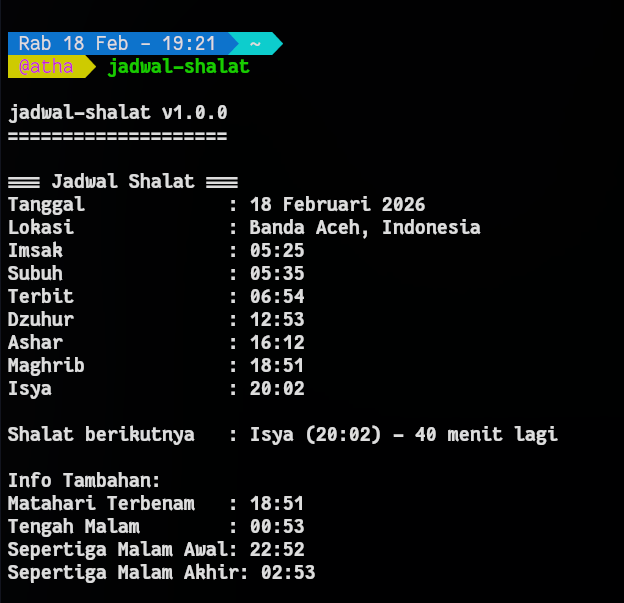

# jadwal-shalat

CLI tool profesional untuk menampilkan jadwal shalat otomatis berdasarkan lokasi IP publik atau input manual. Output rapi, akurat, punya cache lokal, dan siap distribusi (AUR, Snap, dsb).

---

## Fitur Utama

- Deteksi IP publik otomatis atau input manual (`--city`, `--lat/--lon`, `--timezone`).
- GeoIP offline (opsional) dengan fallback ke lokasi tersimpan terakhir.
- Cache lokal per-tanggal, bisa dimatikan via `--no-cache` saat butuh data baru.
- API Aladhan dengan dukungan pemilihan metode (`--method kemenag|mwl|...`).
- Jadwal lengkap + countdown shalat berikutnya, termasuk lintas hari.
- Timezone akurat berkat modul `zoneinfo` builtin Python 3.9+.
- Error handling & timeout agar CLI tetap responsif.
- Siap dikemas ke AUR, Snap, maupun instalasi manual.

---

## Screenshot



## Instalasi

### Arch Linux/AUR (direkomendasikan)

```
yay -S jadwal-shalat
```

### Manual (pip)

```
git clone https://github.com/Bangkah/jadwal-shalat.git
cd jadwal-shalat
python -m venv .venv && source .venv/bin/activate
pip install -r requirements.txt
./jadwal-shalat.py --help
```

---

## Cara Pakai

```
jadwal-shalat
```

Atau (manual):
```
python jadwal-shalat.py
```

---

## Cara Kerja

1. Ambil IP publik user (jika GeoIP aktif) atau gunakan input manual/cached.
2. Deteksi lokasi & timezone (GeoIP, Nominatim, atau lokasi terakhir).
3. Ambil jadwal shalat dari API Aladhan untuk tanggal terkait dan simpan ke cache.
4. Hitung countdown jadwal berikutnya; jika hari sudah berganti, ambil jadwal besok.
5. Tampilkan jadwal utama + info tambahan di terminal.

---

## Dependensi

- Python >= 3.9 (zoneinfo built-in)
- requests
- geoip2 (opsional, untuk deteksi lokasi offline)
- python-tzdata (opsional, untuk distro tertentu)

---

## Kompatibilitas

- Arch Linux (AUR) ✅
- Ubuntu/Debian/Fedora/macOS/Windows ✅

---

## Struktur Project

```
├── jadwal-shalat.py
├── PKGBUILD
├── .SRCINFO
├── LICENSE
├── README.md
└── .github/workflows/
```

---

## Roadmap

- [x] Auto update AUR via GitHub Actions
- [x] Output countdown waktu shalat berikutnya
- [x] Fallback API lokasi + simpan lokasi terakhir
- [x] Input manual kota/koordinat
- [x] Paket Snap (strict confinement)
- [ ] Output JSON
- [ ] Notifikasi waktu shalat
- [ ] Packaging PyPI
- [ ] Engine perhitungan offline

---

## Build Snap Lokal

```
snapcraft clean
snapcraft pack
sudo snap install jadwal-shalat_1.1.0_amd64.snap --dangerous
```

Gunakan `snapcraft pack` (tanpa subcommand lama) supaya kompatibel dengan Snapcraft terbaru. Build pertama kali akan mengunduh base image Multipass sehingga bisa memakan beberapa menit, build selanjutnya jauh lebih cepat.

---

## Keamanan & Privasi

- Tidak menyimpan data user selain lokasi terakhir di `~/.config/jadwal-shalat/`
- Tidak mengirim data sensitif
- Hanya menggunakan API publik (Aladhan, Nominatim, ipify)

---

## Kontribusi

1. Fork repo
2. Buat branch baru
3. Commit perubahan
4. Pull request

---

## Lisensi

MIT License

---

## Author

Muhammad Dhiyaul Atha  
GitHub: https://github.com/Bangkah